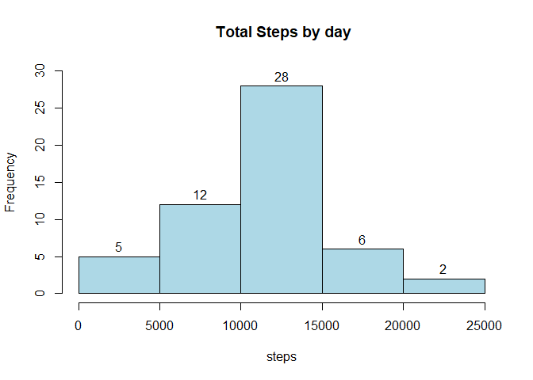
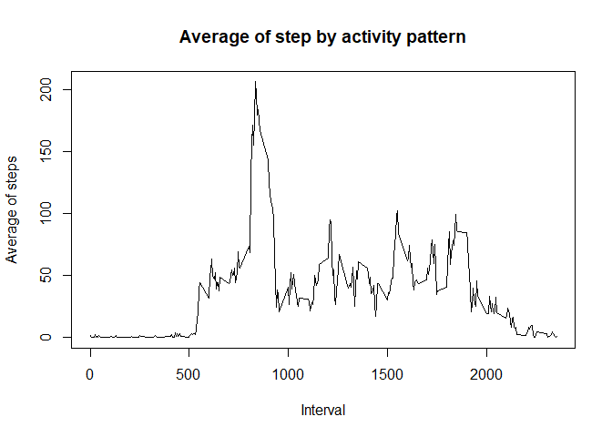
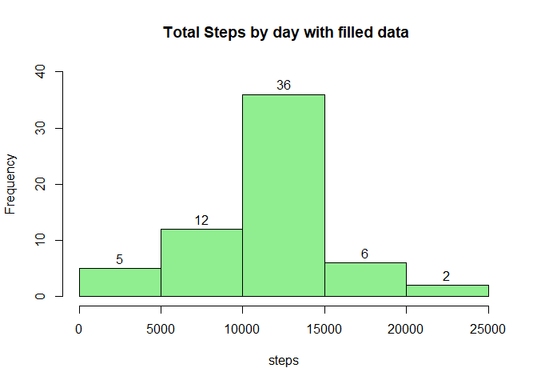
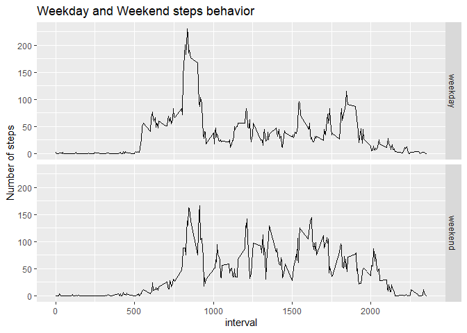

# Reproducible Research Course Project 1.

## Introduction

"It is now possible to collect a large amount of data about personal movement using activity monitoring devices such as a Fitbit, Nike Fuelband, or Jawbone Up. These type of devices are part of the "quantified self" movement - a group of enthusiasts who take measurements about themselves regularly to improve their health, to find patterns in their behavior, or because they are tech geeks. But these data remain under-utilized both because the raw data are hard to obtain and there is a lack of statistical methods and software for processing and interpreting the data."^1^

This project "...makes use of data from a personal activity monitoring device. This device collects data at 5 minute intervals through out the day. The data consists of two months of data from an anonymous individual collected during the months of October and November, 2012 and include the number of steps taken in 5 minute intervals each day."^2^

The data for this project can be downloaded from the course web site:

Dataset: [Activity monitoring data]( https://d396qusza40orc.cloudfront.net/repdata%2Fdata%2Factivity.zip) [52K]

"The variables included in this dataset are:

**steps**: Number of steps taking in a 5-minute interval (missing values are coded as NA)

**date**: The date on which the measurement was taken in YYYY-MM-DD format

**interval**: Identifier for the 5-minute interval in which measurement was taken

The dataset is stored in a comma-separated-value (CSV) file and there are a total of 17,568 observations in this dataset."^3^


## Loading and preprocessing the data.

### Getting data from source.

According to assignment, data can be obtained from the following URL
[https://d396qusza40orc.cloudfront.net/repdata%2Fdata%2Factivity.zip](https://d396qusza40orc.cloudfront.net/repdata%2Fdata%2Factivity.zip) in zip format.

Required libraries will be called for further use.

Assume that observations file is stored in directory "./data" and "activity.csv" has been extracted from "repdata_data_activity.zip", therefore, step observations can be stored into "data" dataset.


```r
library(dplyr)
```

```
## 
## Attaching package: 'dplyr'
```

```
## The following objects are masked from 'package:stats':
## 
##     filter, lag
```

```
## The following objects are masked from 'package:base':
## 
##     intersect, setdiff, setequal, union
```

```r
library(ggplot2)
setwd("C:/Users/owner/Documents/R Studio/Data")
data <- read.csv(file = "activity.csv",header = TRUE,stringsAsFactors = FALSE)
head(data)
```

```
##   steps       date interval
## 1    NA 2012-10-01        0
## 2    NA 2012-10-01        5
## 3    NA 2012-10-01       10
## 4    NA 2012-10-01       15
## 5    NA 2012-10-01       20
## 6    NA 2012-10-01       25
```

```r
str(data)
```

```
## 'data.frame':	17568 obs. of  3 variables:
##  $ steps   : int  NA NA NA NA NA NA NA NA NA NA ...
##  $ date    : chr  "2012-10-01" "2012-10-01" "2012-10-01" "2012-10-01" ...
##  $ interval: int  0 5 10 15 20 25 30 35 40 45 ...
```
*date* column format is character, therefore is need to be converted as date format.


```r
data$date <- as.Date(data$date, "%Y-%m-%d")
```

Some data is missing and it is better to know how many they are and their dates:


```r
sum(is.na(data$steps)) #Total Observations 17,568
```

```
## [1] 2304
```

```r
unique(data[is.na(data$steps),2])
```

```
## [1] "2012-10-01" "2012-10-08" "2012-11-01" "2012-11-04" "2012-11-09"
## [6] "2012-11-10" "2012-11-14" "2012-11-30"
```
2304 observations of 17,568 are missing and corresponds to 8 of 61 days recorded. Less than 14%

## Steps by day analysis.

Histogram of steps. Data must be grouped and summarise by date and ignoring missing observations:


```r
total <- data[!is.na(data$steps),] %>% 
  group_by(date) %>% 
  summarise(Total = sum(steps))
```

```
## `summarise()` ungrouping output (override with `.groups` argument)
```

```r
head(total)
```

```
## # A tibble: 6 x 2
##   date       Total
##   <date>     <int>
## 1 2012-10-02   126
## 2 2012-10-03 11352
## 3 2012-10-04 12116
## 4 2012-10-05 13294
## 5 2012-10-06 15420
## 6 2012-10-07 11015
```

```r
h <- hist(total$Total,col = "lightblue", xlab = "steps", main = " Total Steps by day", ylim = c(0, 30) )
text(h$mids,h$counts,labels = h$counts,adj=c(0.5, -0.5))
```

<!-- -->

28 of 53 days with observations have between 10,000 and 15,000 steps.

Mean and median of total steps:


```r
mean(total$Total)
```

```
## [1] 10766.19
```

```r
median(total$Total)
```

```
## [1] 10765
```

Mean and median are very similar and they are consistent with histogram distribution.

## Average steps by activity pattern.


```r
average <- data[!is.na(data$steps),] %>% 
  group_by(interval) %>%
  summarise(Average = mean(steps))
```

```
## `summarise()` ungrouping output (override with `.groups` argument)
```

```r
plot(average$interval,average$Average, type="l",xlab = "Interval", ylab = "Average of steps", main = "Average of step by activity pattern")
```

<!-- -->

Maximum number of steps is:

```r
max(average$Average)
```

```
## [1] 206.1698
```

## Imputing missing values.

As we observed before, there are 2304 missing observations of 17,568 and corresponds to 8 of 61 days recorded. 

Mean value per activity interval in *average* dataset can be used to substitute these missing values.

By splitting *data* by NA and not NA observations, it can be added mean values for interval with missing observations.


```r
missing <- data[is.na(data$steps),]
observations <- data[!is.na(data$steps),]
filldata <- merge(missing,average,by.x=3,by.y=1)
head(filldata)
```

```
##   interval steps       date  Average
## 1        0    NA 2012-10-01 1.716981
## 2        0    NA 2012-11-30 1.716981
## 3        0    NA 2012-11-04 1.716981
## 4        0    NA 2012-11-09 1.716981
## 5        0    NA 2012-11-14 1.716981
## 6        0    NA 2012-11-10 1.716981
```

```r
str(missing)
```

```
## 'data.frame':	2304 obs. of  3 variables:
##  $ steps   : int  NA NA NA NA NA NA NA NA NA NA ...
##  $ date    : Date, format: "2012-10-01" "2012-10-01" ...
##  $ interval: int  0 5 10 15 20 25 30 35 40 45 ...
```

```r
str(filldata)
```

```
## 'data.frame':	2304 obs. of  4 variables:
##  $ interval: int  0 0 0 0 0 0 0 0 5 5 ...
##  $ steps   : int  NA NA NA NA NA NA NA NA NA NA ...
##  $ date    : Date, format: "2012-10-01" "2012-11-30" ...
##  $ Average : num  1.72 1.72 1.72 1.72 1.72 ...
```

```r
filldata <- filldata[,c(4,3,1)] #Removing steps column with NA
names(filldata)[1] <- "steps"
modified <- rbind(observations,filldata) # binding observations and filled data
modified <- modified[order(modified[2],modified[3]),] # ordering by date and interval
str(modified)
```

```
## 'data.frame':	17568 obs. of  3 variables:
##  $ steps   : num  1.717 0.3396 0.1321 0.1509 0.0755 ...
##  $ date    : Date, format: "2012-10-01" "2012-10-01" ...
##  $ interval: int  0 5 10 15 20 25 30 35 40 45 ...
```

Histogram of steps with filled data. Data must be grouped and summarise by date:


```r
totalmod <- modified %>% 
  group_by(date) %>% 
  summarise(Total = sum(steps))
```

```
## `summarise()` ungrouping output (override with `.groups` argument)
```

```r
head(totalmod)
```

```
## # A tibble: 6 x 2
##   date        Total
##   <date>      <dbl>
## 1 2012-10-01 10766.
## 2 2012-10-02   126 
## 3 2012-10-03 11352 
## 4 2012-10-04 12116 
## 5 2012-10-05 13294 
## 6 2012-10-06 15420
```

```r
h <- hist(totalmod$Total,col = "lightgreen", xlab = "steps", main = " Total Steps by day with filled data", ylim = c(0, 40) )
text(h$mids,h$counts,labels = h$counts,adj=c(0.5, -0.5))
```

<!-- -->

36 of 61 days with observations have between 10,000 and 15,000 steps.

Mean and median of total steps:


```r
mean(totalmod$Total)
```

```
## [1] 10766.19
```

```r
median(totalmod$Total)
```

```
## [1] 10766.19
```
Both median and mean converge to average value. Additionally, median value differs from original measurement. From this perspective, impact seems to be very little by substituting missing values with its average.

Also, all observations seems to be completed and it is important to be aware that filled data is not an integer value of *steps*, also could be useful to comment and identify which *dates* and *intervals* have been filled with its average values to avoid false conclusions.

## Analysis of weekdays and weekend patterns.

*type* is an added column to *modified* dataset, it evaluates if date is a weekend or weekday. With this new variable, *modified* dataset can be analysed by this parameter and determine if weekend behavior could be different from weekdays.


```r
modified$type <- ifelse(format(modified$date,"%u") %in% c(6,7),"weekend","weekday")
str(modified)
```

```
## 'data.frame':	17568 obs. of  4 variables:
##  $ steps   : num  1.717 0.3396 0.1321 0.1509 0.0755 ...
##  $ date    : Date, format: "2012-10-01" "2012-10-01" ...
##  $ interval: int  0 5 10 15 20 25 30 35 40 45 ...
##  $ type    : chr  "weekday" "weekday" "weekday" "weekday" ...
```

```r
head(unique(paste(modified$date,format(modified$date,"%a"),modified$type)),14)
```

```
##  [1] "2012-10-01 lun. weekday" "2012-10-02 mar. weekday"
##  [3] "2012-10-03 mié. weekday" "2012-10-04 jue. weekday"
##  [5] "2012-10-05 vie. weekday" "2012-10-06 sáb. weekend"
##  [7] "2012-10-07 dom. weekend" "2012-10-08 lun. weekday"
##  [9] "2012-10-09 mar. weekday" "2012-10-10 mié. weekday"
## [11] "2012-10-11 jue. weekday" "2012-10-12 vie. weekday"
## [13] "2012-10-13 sáb. weekend" "2012-10-14 dom. weekend"
```


```r
weekdayave <- modified %>% 
  group_by(type,interval) %>%
  summarise(Average = mean(steps))
```

```
## `summarise()` regrouping output by 'type' (override with `.groups` argument)
```

```r
qplot(interval,Average, data = weekdayave, facets = type~., geom = "path", ylab="Number of steps", main = "Weekday and Weekend steps behavior")
```

<!-- -->

```r
tapply(weekdayave$Average, weekdayave$type, summary)
```

```
## $weekday
##    Min. 1st Qu.  Median    Mean 3rd Qu.    Max. 
##   0.000   2.247  25.803  35.611  50.854 230.378 
## 
## $weekend
##    Min. 1st Qu.  Median    Mean 3rd Qu.    Max. 
##   0.000   1.241  32.340  42.366  74.654 166.639
```

```r
tapply(weekdayave$Average, weekdayave$type, sum)
```

```
##  weekday  weekend 
## 10255.85 12201.52
```
Observations on weekend are almost 2,000 steps more than weekday, about 19% more. In addition, weekend curve is over 25 steps per interval later than weekday, and it get under 25 steps by the end of the day, also later than weekday.

Maximum step per interval is greatest during weekdays.

# References
Coursera, Reproducible Research Course Project Assignment instructions, [https://www.coursera.org/learn/reproducible-research/peer/gYyPt/course-project-1](https://www.coursera.org/learn/reproducible-research/peer/gYyPt/course-project-1)

# Citations
^1^, ^2^, ^3^  Coursera, Reproducible Research, Course project assignment instructions. [https://www.coursera.org/learn/reproducible-research/peer/gYyPt/course-project-1](https://www.coursera.org/learn/reproducible-research/peer/gYyPt/course-project-1)
